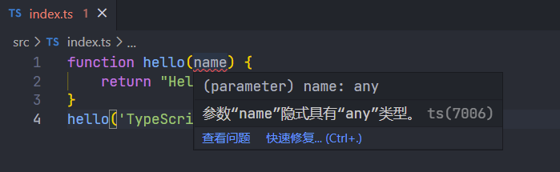
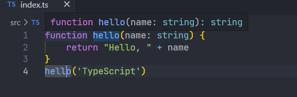
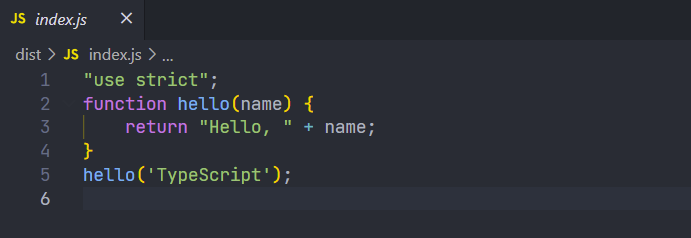

## 使用前准备

- 需要有 `node` 环境和 `npm` 包管理器(安装node同时会自动安装npm包管理器)[下载地址](https://nodejs.org/zh-cn/download/)。
- 编辑器(推荐使用 `vscode` )

## 安装TypeScript

使用 `npm` 全局安装 typescript

```bash
npm install typescript -g

# 查看 typescript 版本
tsc -v 
```

## 创建项目环境

1. 创建项目目录

```bash
mkdir learn-typescript && cd learn-typescript
```

2. 创建 `src` 目录和 `index.ts` 文件

```bash
# bash
mkdir src && touch src/index.ts

# PowerShell
# mkdir src && cd > src/index.ts
# 新版本PowerShell有可能报错，提示标记“&&”不是此版本中的有效语句分隔符。则使用“;”进行分割
# mkdir src ; cd > src/index.ts
```

3. 初始化 `package.json` 配置文件

```bash 
npm init
```

4. 初始化 `tsconfig.json` 配置文件

```bash 
# 已经全局安装了typescript，才能使用tsc命令
tsc --init
```

5. 配置 `tsconfig.json` 和 `package.json`

[更多关于tsconfig.json的配置](https://aka.ms/tsconfig.json)

```json title='tsconfig.json'
{
  // 可以通过 compilerOptions 来定制你的编译选项
  "compilerOptions": {
    "target": "es2016", // 指定 ECMAScript 目标版本
    "module": "commonjs", // 指定使用模块: 'commonjs', 'amd', 'system', 'umd' or 'es2015'
    "moduleResolution": "node", // 选择模块解析策略
    "lib": [
      "es6",
      "dom"
    ], // 指定要包含在编译中的库文件
    "outDir": "./dist", // 指定输出目录
    "allowJs": true, // 允许编译 javascript 文件
    "checkJs": true, // 报告 javascript 文件中的错误
    "removeComments": true, // 删除编译后的所有的注释
    "importHelpers": true, // 从 tslib 导入辅助工具函数
    "strict": true, // 启用所有严格类型检查选项, 等于其它选项的总开关，开启该项等于开启所有的严格模式配置。
    "noImplicitAny": true, // 在表达式和声明上有隐含的 any类型时报错
    "noImplicitThis": true, // 当 this 表达式值为 any 类型的时候，生成一个错误
    "alwaysStrict": true, // 以严格模式检查模块，并在每个文件里加入 'use strict'
    "noUnusedLocals": true, // 有未使用的变量时，抛出错误
    "noUnusedParameters": true, // 有未使用的参数时，抛出错误
    "noImplicitReturns": true, // 并不是所有函数里的代码都有返回值时，抛出错误
    "experimentalDecorators": true, // 启用装饰器
    "emitDecoratorMetadata": true, // 为装饰器提供元数据的支持
  },
  // 使用 include 和 exclude 选项来指定需要包含的文件和排除的文件：
  "include": [ // 需要编译的ts文件，*表示文件匹配，**表示忽略文件的深度问题
    "./src/**/*.ts"
  ],
  "exclude": [
    "node_modules",
    "dist",
    "**/*.test.ts",
  ]
}
```
:::tip
使用 globs：`**/*` 

示例用法：`some/folder/**/*`，意味着匹配所有的文件夹和所有文件（扩展名为 `.ts/.tsx`，当开启了 allowJs: true 选项时，扩展名可以是 `.js/.jsx`）。
:::

```json title='package.json'
{
  "name": "learn-typescript",
  "version": "1.0.0",
  "description": "",
  "main": "src/index.ts",
  "scripts": {
    "build": "tsc", // 使用tsc进行编译
    "build:w": "tsc -w" // 监听文件，有变动即编译
  },
  "keywords": [
    "typescript"
  ],
  "author": "",
  "license": ""
}
```

## 编写第一个 TypeScript 程序 

```ts title='index.ts'
function hello(name) {
    return "Hello, " + name
}
hello('TypeScript')
```
这个时候你会看到一个警告，这个警告在官方默认配置中是不会出现的,正是由于我们开启了 `noImplicitAny` 选项,对于隐式含有 `any` 类型的参数或者变量进行警告



之所以一开始就开启严格模式，是因为一旦你开始放任 `any` 类型的泛滥，就会把 TypeScript 变成 AnyScript ，所以最好从一开始就要用规范的 TypeScript 编码习惯

我们为 `name` 参数添加 `string` 类型，修改如下：

```ts title='index.ts'
function hello(name: string) {
  return "Hello, " + name
}
hello('TypeScript')
```
移动到函数 `hello` 上，此时我们可以看到，`hello` 函数会自动加上返回值的类型，这是 TypeScript 自带的类型推导。




## 查看编译结果

执行编译命令脚本

```bash
# 可以使用tsc进行一次编译
npm run build

# 或者监听文件，有变动即编译
# npm run build:w
```

因为在 `tsconfig.json` 文件配置中，指定了编译后的 js 文件输出的目录，为当前项目的 `dist` 文件夹

所以我们可以打开 `dist` 文件夹看到编译后 js 文件，打开 `index.js`，可以看到 `hello` 函数被编译后的输出结果



