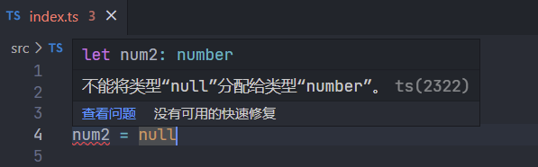
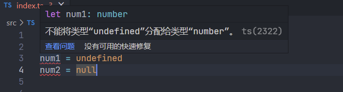
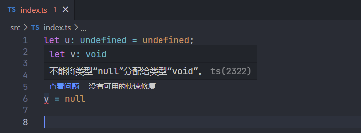
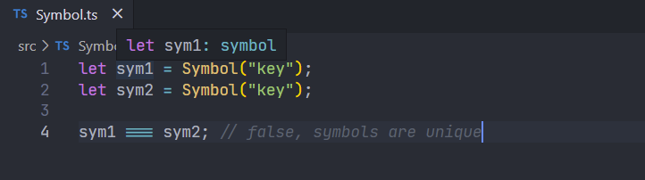

## 基本注解

类型注解使用 `:TypeAnnotation` 语法，如下：

```ts
let num: number = 123;
```

## 原始类型

TypeScript的原始类型包括: `boolean、number、string、void、undefined、null、symbol、bigint`

### 布尔

```ts
let flag: boolean = false
```

### 数字

```ts
let num: number = 123;
```

### 字符串

```ts
let name: string = 'typescript'
```

### void

表示没有任何类型，当一个函数没有返回值时，其返回值类型是 `void`：

```ts
function sayHello(): void {
    console.log("Hello, TypeScript");
}
```

函数的返回类型一旦被指定为void，它便不能返回任何类型的值（undefined除外）。

```ts
function hello():void{
    return;
}
```

### null 和 undefined

TypeScript 里，`undefined` 和 `null` 两者各自有自己的类型分别叫做 `undefined` 和 `null`，和 `void` 相似，它们的本身的类型用处不是很大：

默认情况下 `null` 和 `undefined` 是所有类型的子类型，就是说你可以把 `null` 和 `undefined` 赋值给 `number` 类型的变量。

```ts
let num1: number = 1
let num2: number = 2

num1 = undefined // if strictNullChecks disabled.
num2 = null // if strictNullChecks disabled.
```

```ts
let u: undefined = undefined;
let n: null = null;
let v: void

v = undefined
v = null // if strictNullChecks disabled.
```

但是在正式项目中一般都是开启 `strictNullChecks` 检测的模式，即 `null` 只能赋值给它自己，`undefined` 可以赋值给它自己和 `void`，这样可以规避非常多的问题。

否则就会进行报错提示







### symbol

`Symbol` 是在ES2015之后成为新的原始类型,它通过 `Symbol` 构造函数创建:

```ts
let sym1 = Symbol("key");
let sym2 = Symbol("key");

sym1 === sym2; // false, symbols are unique
```



### bigint

[BigInt](https://developer.mozilla.org/zh-CN/docs/Web/JavaScript/Reference/Global_Objects/BigInt) 是一种内置对象，它提供了一种方法来表示大于 `2^53 - 1` 的整数。这原本是 Javascript中可以用 `Number` 表示的最大数字。`BigInt` 可以表示任意大的整数。

使用 `BigInt` 可以安全地存储和操作大整数，即使这个数已经超出了JavaScript构造函数 Number 能够表示的安全整数范围。

`Number.MAX_SAFE_INTEGER` 给出了可以安全递增的最大可能整数，如下：

```ts
const max = Number.MAX_SAFE_INTEGER;
const max1 = max + 1
const max2 = max + 2

max1 === max2 //true
```

`max1` 与 `max2` 居然相等，这就是超过精度范围造成的问题，而 `BigInt` 正是解决这类问题而生的:

可以用在一个整数字面量后面加 `n` 的方式定义一个 `BigInt` ，如：10n，或者调用函数BigInt()。

```ts
const max = BigInt(Number.MAX_SAFE_INTEGER);
const max1 = max + 1n
const max2 = max + 2n
max1 === max2 // false
```

`number` 类型虽然和 `BigInt` 都是有表示数字的意思，但是实际上两者类型是不同的:

```ts
declare let foo: number;
declare let bar: bigint;

foo = bar; // error: Type 'bigint' is not assignable to type 'number'.
bar = foo; // error: Type 'number' is not assignable to type 'bigint'.
```

## 参考文档

[深入浅出TypeScript](https://www.yuque.com/cuggz/ts/nkxqne)

[TypeScript入门教程](https://ts.xcatliu.com/basics/type-of-array.html)

