> 工欲善其事，必先利其器。


## 美化类

这类插件主要作用就是美化我们的 `VSCode` ，当然每个人喜欢的都不一样，本人比较喜欢暗色。

[更多主题相关插件](https://marketplace.visualstudio.com/search?target=VSCode&category=Themes&sortBy=Installs)


###  Atom One Dark Theme

一个 `VSCode` 主题插件，个人比较喜欢偏暗色主题。

[插件下载地址](https://marketplace.visualstudio.com/items?itemName=akamud.vscode-theme-onedark)

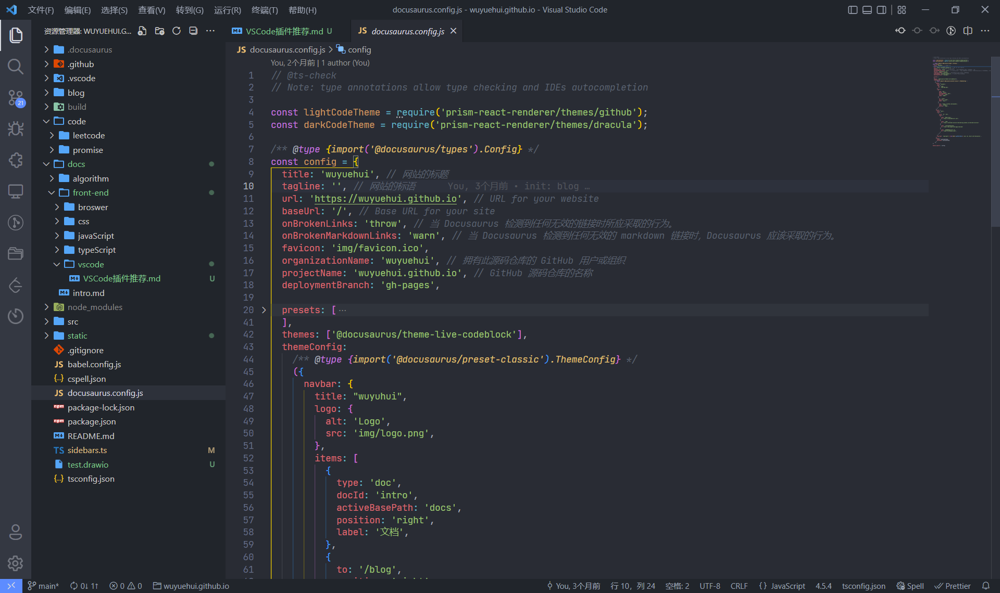


###  VSCode Great Icons

一个文件图标插件，主要用于区分各种文件显示，可以更好的找到不同的文件。

[插件下载地址](https://marketplace.visualstudio.com/items?itemName=emmanuelbeziat.vscode-great-icons)

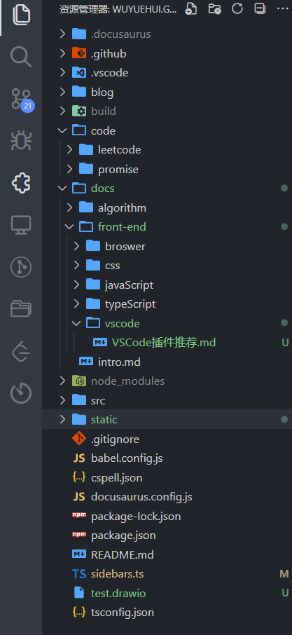


### Fluent Icons

可以改变 `VSCode` 默认的产品图标。

[插件下载地址](https://marketplace.visualstudio.com/items?itemName=miguelsolorio.fluent-icons)

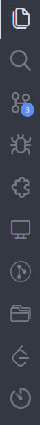


## 扩展类

这类插件主要用于扩展 `VSCode` 的功能。

### Draw.io Integration

一个画图软件，可以画各种图。

[插件下载地址](https://marketplace.visualstudio.com/items?itemName=hediet.vscode-drawio)

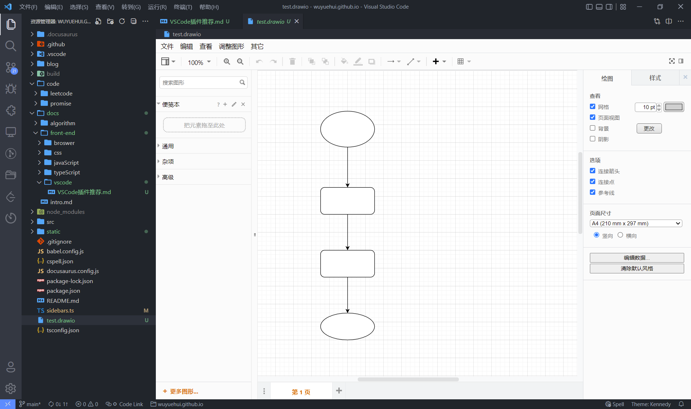


### Project Manager

它可以帮助您轻松地访问您的项目。

[插件下载地址](https://marketplace.visualstudio.com/items?itemName=alefragnani.project-manager)

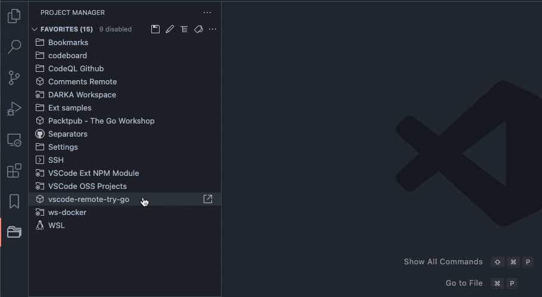


### LeetCode

让你可以 在 `VSCode` 刷 `leetcode` ，前提需要登录。

[插件下载地址](https://marketplace.visualstudio.com/items?itemName=LeetCode.vscode-leetcode)

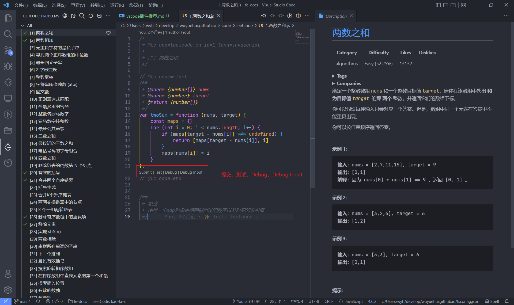

下载完成后，请先看 [LeetCode README](https://github.com/LeetCode-OpenSource/vscode-leetcode/blob/master/docs/README_zh-CN.md) 进行使用

:::tip
最好配合一起使用 [Debug LeetCode](https://marketplace.visualstudio.com/items?itemName=wangtao0101.debug-leetcode)，帮助你可以在 vscode 进行调试

使用前请阅读 [Debug LeetCode README](https://github.com/wangtao0101/vscode-debug-leetcode/blob/master/docs/README_zh-CN.md)
:::


### Time Master

统计编码时间

[插件下载地址](https://marketplace.visualstudio.com/items?itemName=iceworks-team.iceworks-time-master)

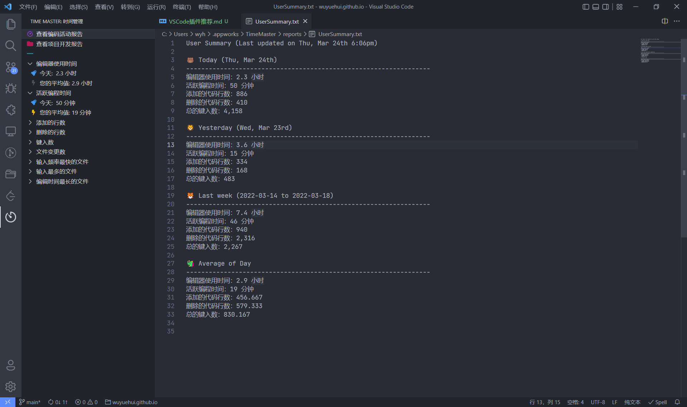


## 工具类

### GitLens — Git supercharged

功能比较多，也很实用，建议详细查看 [README](https://github.com/gitkraken/vscode-gitlens/blob/main/README.md)

[插件下载地址](https://marketplace.visualstudio.com/items?itemName=eamodio.gitlens)


### Prettier - Code formatter

前端代码格式化工具

[插件下载地址](https://marketplace.visualstudio.com/items?itemName=esbenp.prettier-vscode)


### EditorConfig for VS Code

当大家在公司工作时，不可能永远是一个人维护一个项目，当多个人参与一个项目，每个人使用的编辑器不一样，代码风格自然也不一样，那么如何让使用不同编辑器的开发者能够轻松惬意的遵守最基本的代码规范呢？

[插件下载地址](https://marketplace.visualstudio.com/items?itemName=EditorConfig.EditorConfig)

首先安装此扩展，然后在当前项目根目录下添加 `.editorconfig` 文件，插件的作用是读取 `.editorconfig` 文件中定义的规则，并覆盖 `user/workspace settings` 中的对应配置（vscode本身是并不直接支持 `editorconfig` 的）

示例：

```text title=".editorconfig" 
# EditorConfig is awesome: https://EditorConfig.org

root = true

[*]
end_of_line = lf
trim_trailing_whitespace = true
insert_final_newline = true

[*.ts]
indent_style = tab

[{*.json,*.md,*.yml}]
indent_style = space
indent_size = 2
```

这个插件只能简单的配置一些规范，并不能完全满足需求，所以还需要其它代码检查工具配合使用，比如说：`ESLint` 来统一代码风格。

### Eslint

将 `ESLint` 集成到 `VSCode` 中， `ESLint` 主要用于对前端代码规范进行检测。

关于 ESLint 的配置，请查看 [Configuring ESLint](https://eslint.org/docs/user-guide/configuring/)

[插件下载地址](https://marketplace.visualstudio.com/items?itemName=dbaeumer.vscode-eslint)


### Error Lens

改善突出的错误、警告和其他语言的诊断，并内联打印消息。

[插件下载地址](https://marketplace.visualstudio.com/items?itemName=usernamehw.errorlens)

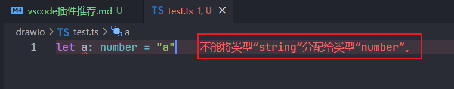


### Code Spell Checker

拼写检查，可以很好地与驼峰大小写代码配合使用，拼写不正确就会进行提示。

[插件下载地址](https://marketplace.visualstudio.com/items?itemName=streetsidesoftware.code-spell-checker)

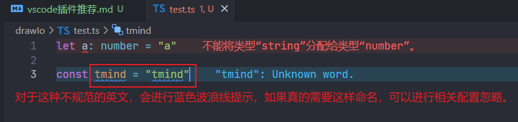


### Image Preview

[插件下载地址](https://marketplace.visualstudio.com/items?itemName=kisstkondoros.vscode-gutter-preview)

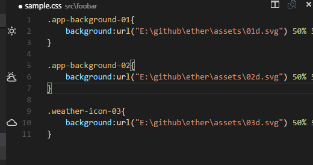


### Live Preview

[插件下载地址](https://marketplace.visualstudio.com/items?itemName=ms-vscode.live-server)


### Version lens

[插件下载地址](https://marketplace.visualstudio.com/items?itemName=pflannery.vscode-versionlens)

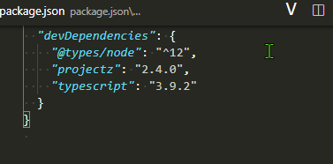


### npm Dependency Links

[插件下载地址](https://marketplace.visualstudio.com/items?itemName=herrmannplatz.npm-dependency-links)

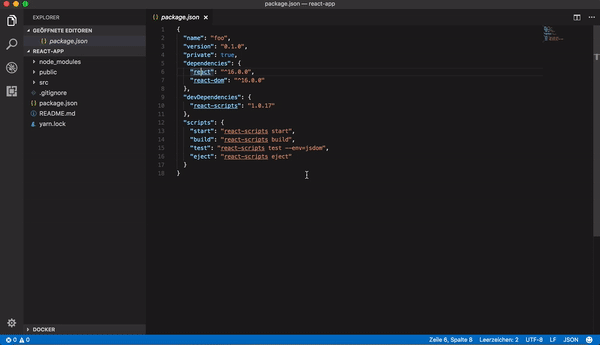


### CSS Peek

[插件下载地址](https://marketplace.visualstudio.com/items?itemName=pranaygp.vscode-css-peek)


### Comment Translate

适合阅读源码

[插件下载地址](https://marketplace.visualstudio.com/items?itemName=intellsmi.comment-translate) 

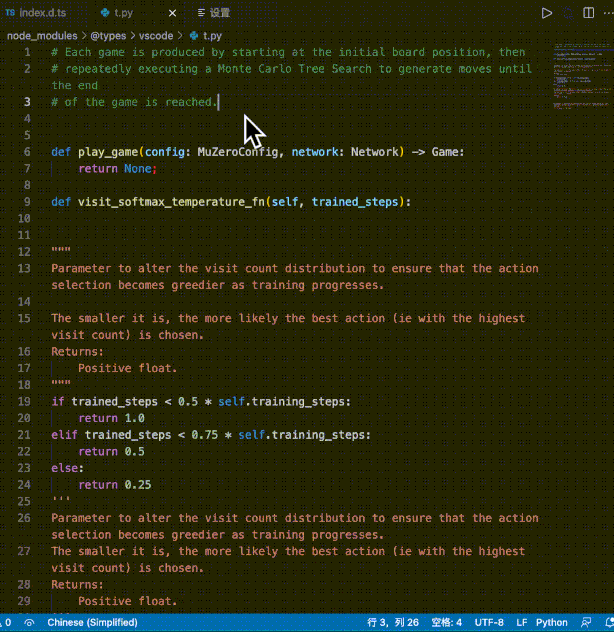


### any rule

一般正则都是学的时候还知道，写的时候就不知道了，于是需要去查找。这个插件提供一系列正则，可以直接使用。

[插件下载地址](https://marketplace.visualstudio.com/items?itemName=russell.any-rule)

方式1：
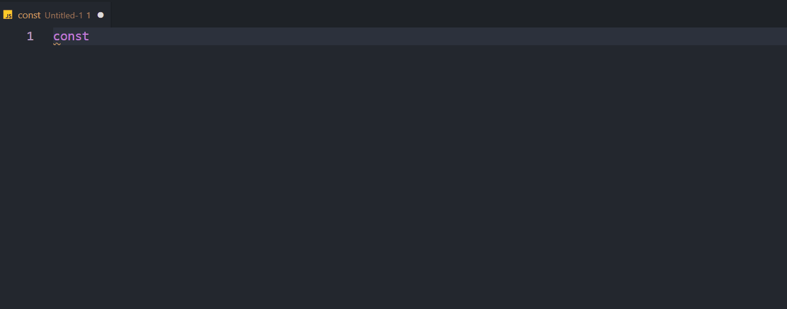

方式2：
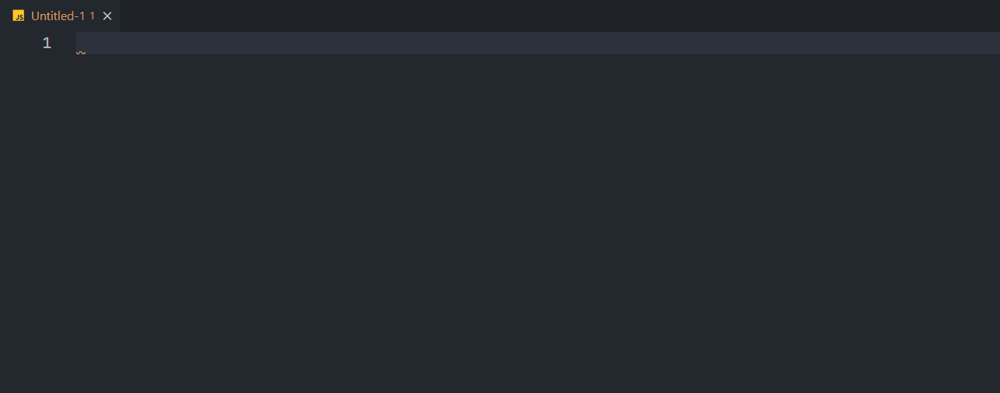

方式3：
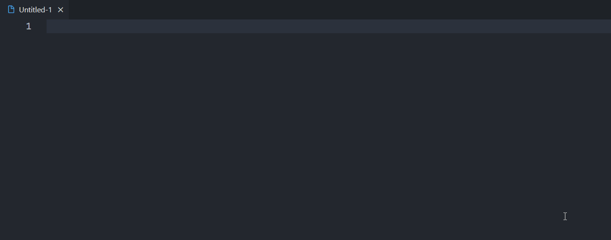
