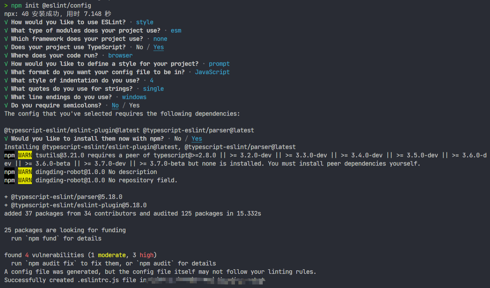

## 使用前准备

- 需要有 node 环境和 npm 包管理器(安装node同时会自动安装npm包管理器)[下载地址](https://nodejs.org/zh-cn/download/)。
- 编辑器(推荐使用 VSCode )
- 编辑器需要安装 ESLint 和 Prettier 插件


## ESLint 和 Prettier 区别

ESLint 的功能是对代码格式和代码质量进行校验。

Prettier 只是对代码格式进行校验，不会对代码质量进行校验。

:::tip
代码格式：单行代码长度、 单双引号、tab 长度、分号等问题。

代码质量：未使用变量、三等号、全局变量声明等问题。
:::

## ESLint 配合 Prettier使用

### 为什么要两者配合使用

- ESLint 在推出 `--fix` 参数前，并没有自动格式化代码的功能，而 Prettier 可以自动格式化代码。
- ESLint 虽然也可以校验代码格式，但 Prettier 更擅长。


### 配合使用的问题的

但是当 ESLint 和 Prettier 配合使用时，有可能会有一些问题，对于他们交集的部分规则，ESLint 和 Prettier 格式化后的代码不一致。

例如：针对字符串使用单引号还是双引号的问题， ESLint 和 Prettier 分别对应如下规则：

- ESLint: quotes - enforce the consistent use of either backticks, double, or single quotes, 默认是 double

- Prettier: prettier.singleQuote, 默认是 false

假如这样一行代码 `const a = "wyh"`，用 Prettier 格式化后变成了 `const a = 'wyh'`，再用 ESLint 去检测，就会报 Strings must use doublequote；当你用 `eslint --fix` 自动修复这个问题后又无法通过 Prettier 的校验，结果陷入死循环。


### 解决方案

解决思路是禁掉 ESLint 中与 Prettier 冲突的规则，然后使用 Prettier 做格式化， ESLint 做代码校验。

举例，我们在 .eslintrc.js 禁掉 quotes 这条规则，然后在 .prettierrc 中配置使用单引号

```js title=.eslintrc.js
module.exports = {
    ...
    
    "rules": {
        "quotes": "off"
    }
} 
```

```json title=.prettierrc
{
  "singleQuote": true
}
```

社区提供了两个包 eslint-config-prettier 和 eslint-plugin-prettier

- eslint-config-prettier

    可以禁掉 ESLint 中与 Prettier 冲突的规则，里面定义了被禁掉的 ESLint 规则。

- eslint-plugin-prettier

    定义一条规则 prettier/prettier，调用 Prettier ，配合 ESLint 实现运行 `eslint --fix` 按 Prettier 规则自动格式化代码。


## 具体使用

### 1. 安装相关的包

```bash
npm i typescript eslint prettier eslint-config-prettier eslint-plugin-prettier -D
```

### 2. 初始化配置

初始化 tsconfig.json 配置文件

```bash
tsc --init
```

因为初始化后的默认配置文件里，有太多的配置，这里不进行展示了。

:::tip
如果 tsconfig.json 文件发出警告，在配置文件 `"c:/Users/xxx/xxx/tsconfig.json"` 中找不到任何输入。指定的 include 路径为`["**/*"]`，exclude 路径为 `[]`。

不要担心，是因为当前默认 include 匹配的路径下，没有找到任何匹配的 ts 文件，你可以在 src 目录下新建一个 index.ts ，警告就会消失了。
:::


初始化 eslintrc.js 配置文件

```bash
npm init @eslint/config
```

运行以后会让你选择一系列的配置，你可以根据自己的需要选择相应的配置，如下图：




因为我在这里选择了项目使用 TypeScript，所以它会提示我需要额外安装 @typescript-eslint/eslint-plugin 和 @typescript-eslint/parser 这两个包，当然你也可以自己使用以下命令，手动进行安装。

```bash
npm i @typescript-eslint/eslint-plugin @typescript-eslint/parser -D
```

然后会在你的根目录下多出一个 .eslintrc.js 文件，更多配置及其相关解释请看 [ESLint 官网](https://eslint.org/docs/user-guide/configuring/)。

```js title=.eslintrc.js
module.exports = {
    // 环境
    "env": {
        "browser": true,
        "es2021": true
    },
    // 继承另一个配置文件的所有特性
    "extends": [
        "eslint:recommended",
        "plugin:@typescript-eslint/recommended"
    ],
    // 解释器
    "parser": "@typescript-eslint/parser",
    // 解释器的配置
    "parserOptions": {
        // 指定 ECMAScript 版本
        "ecmaVersion": "latest",
        // 模块类型
        "sourceType": "module"
    },
    // 插件，可以向 ESLint 添加各种扩展，可以定义规则，环境或配置的第三方模块
    "plugins": [
        "@typescript-eslint"
    ],
    // 规则
    "rules": {
        "indent": [
            "error",
            4
        ],
        "linebreak-style": [
            "error",
            "windows"
        ],
        "quotes": [
            "error",
            "single"
        ],
        "semi": [
            "error",
            "never"
        ]
    }
}
```

### 3. 修改相关配置

修改 tsconfig.json 配置

```json title=tsconfig.json
{
  "compilerOptions": {
    "target": "es2016",
    "module": "esnext",
    "moduleResolution": "node",
    "resolveJsonModule": true,
    "strict": true,
    "allowSyntheticDefaultImports": true,
    "skipLibCheck": true
  },
  "include": [
    "src"
  ],
  "exclude": [
    "node_modules",
    "dist",
    "test"
  ]
}
```

修改 .eslintrc.js 配置

```js title=.eslintrc.js
const OFF = 0
const ERROR = 2

module.exports = {
    "env": {
        "browser": true,
        "es2021": true,
        "node": true,
    },
    "extends": ['eslint:recommended', 'plugin:@typescript-eslint/recommended', 'prettier'],
    "parser": '@typescript-eslint/parser',
    "parserOptions": {
        "ecmaVersion": 'latest',
        "sourceType": 'module',
    },
    "plugins": ['@typescript-eslint', 'prettier'],
    "rules": {
        'prettier/prettier': ERROR,
        'no-console': OFF,
    },
}
```

:::tip
.eslintrc.js 配置文件中

extends 中 eslint-config 开头的 npm 包，使用时可省略前缀 eslint-config-

plugins 中 eslint-config 开头的 npm 包，使用时可省略前缀 eslint-plugin-
:::


增加 .prettierrc 配置文件

```json title=.prettierrc
{
    "printWidth": 100,
    "semi": false,
    "singleQuote": true,
    "tabWidth": 4,
    "useTabs": false,
    "bracketSpacing": true,
    "arrowParens": "always",
    "endOfLine": "auto"
}
```

:::tip
VSCode中 想要在保存文件时，按照 eslint 配置规则进行修复，需要在 settings.json 按照如下配置
:::

```json title=settings.json
"editor.codeActionsOnSave": {
    "source.fixAll.eslint": true
}
```

## 参考文档

[深入浅出之ESLint](https://juejin.cn/post/7028754877312401444)

[ESLint 之与 Prettier 配合使用](https://juejin.cn/post/6924568874700505102)